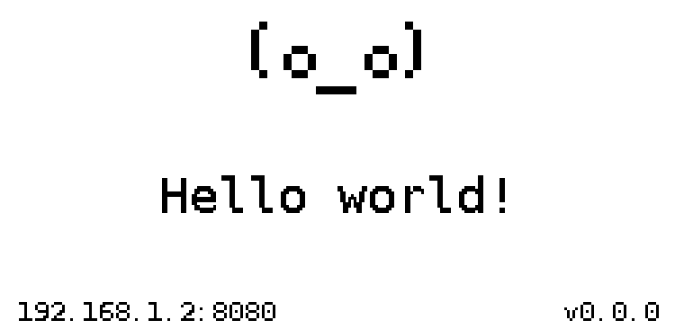

# InkyPal

<p align="center">
  
</p>

`InkyPal` is a tiny smart companion on e-ink.

It presents a friendly face, exposes a small HTTP API, and shows short updates on screen.

## Hardware

- Raspberry Pi Zero 2 W H (SPI enabled on Raspberry Pi OS)
- Waveshare 2.13 inch e-Paper Display V4

## Setup

Download the latest release binary for your system:

```bash
curl -L -o inkypal <release-binary-url>
```

Install it to `/usr/local/bin`:

```bash
chmod +x inkypal
sudo mv inkypal /usr/local/bin/inkypal
```

You also need to enable the Raspberry Pi SPI interface for the display:

```bash
sudo raspi-config
```

In `raspi-config`, enable:

- `Interface Options` -> `SPI`

`InkyPal` is designed to run as a `systemd` service so it starts automatically on boot and stays running.

Create `/etc/inkypal.env`:

```bash
sudo tee /etc/inkypal.env >/dev/null <<'EOF'
# Optional: set a fixed API port instead of a random one.
# INKYPAL_PORT=8080
EOF
```

Create the service file:

```bash
sudo tee /etc/systemd/system/inkypal@.service >/dev/null <<'EOF'
[Unit]
Description=InkyPal smart companion bot
After=network-online.target
Wants=network-online.target

[Service]
Type=simple
User=%i
EnvironmentFile=-/etc/inkypal.env
ExecStart=/usr/local/bin/inkypal
Restart=always
RestartSec=3

[Install]
WantedBy=multi-user.target
EOF
```

Enable and start it for your username:

```bash
sudo systemctl daemon-reload
sudo systemctl enable --now inkypal@$(whoami).service
```

Check status:

```bash
sudo systemctl status inkypal@$(whoami).service
```

Restart after changes:

```bash
sudo systemctl restart inkypal@$(whoami).service
```

Read recent logs:

```bash
sudo journalctl -u inkypal@$(whoami).service -n 20 --no-pager
```

## API

When `InkyPal` starts, it listens on a random local port by default, shows the IP and port on the display, and is meant to be controlled through the API.

If `INKYPAL_PORT` is set in the service environment, that port is used instead of a random one.

### GET /

Returns a small API index with `running: true` and the list of available endpoints.

Example:

```bash
curl http://PI_IP:PORT/
```

### GET /health

Returns the health state of the running service and display session.

Example:

```bash
curl http://PI_IP:PORT/health
```

### GET /status

Returns the current companion state, including the current face, message, IP, and port.

Example:

```bash
curl http://PI_IP:PORT/status
```

### GET /faces

Returns the list of available built-in face names.

Example:

```bash
curl http://PI_IP:PORT/faces
```

### POST /message

Updates the companion display.

Custom face/content updates are temporary. After 1 minute, the content is cleared and the idle face animation resumes.

JSON body fields:

- `face` - optional built-in face name
- `content` - optional message shown below the face

Unknown built-in face names return `400`. Use `GET /faces` as the source of truth for the current built-in list.

Example with a built-in face:

```bash
curl -X POST http://PI_IP:PORT/message \
  -H 'Content-Type: application/json' \
  -d '{"face":"alert","content":"API update"}'
```

### POST /off

Clears the display to white and pauses the idle animation until the next `POST /message` update.

Example:

```bash
curl -X POST http://PI_IP:PORT/off
```

## Development

- Local source checkout:

```bash
git clone https://github.com/derogab/inkypal ~/inkypal
cd ~/inkypal
```

- Install Python dependencies:

```bash
python3 -m pip install -r requirements.txt
```

- Source code: `src/inkypal/`
- Tests: `tests/`

Quick local syntax check:

```bash
python3 -m compileall src/inkypal tests
```

Run the test suite:

```bash
PYTHONPATH=src python3 -m unittest discover -s tests
```

## References

- [Waveshare official e-Paper repository](https://github.com/waveshareteam/e-Paper)
- [Upstream `epd2in13_V4.py` driver](https://github.com/waveshareteam/e-Paper/blob/master/RaspberryPi_JetsonNano/python/lib/waveshare_epd/epd2in13_V4.py)
- [Upstream `epdconfig.py` driver support module](https://github.com/waveshareteam/e-Paper/blob/master/RaspberryPi_JetsonNano/python/lib/waveshare_epd/epdconfig.py)
- [Waveshare 2.13inch e-Paper HAT (G) Manual](https://www.waveshare.com/wiki/2.13inch_e-Paper_HAT_(G)_Manual)

## Inspiration

Even though InkyPal is a much smaller project with a different goal, it is inspired by [pwnagotchi](https://github.com/evilsocket/pwnagotchi).

## Credits

_InkyPal_ is made with ♥ by [derogab](https://github.com/derogab) and it's released under the [GPL-3.0 license](./LICENSE).

## Contributors

<a href="https://github.com/derogab/inkypal/graphs/contributors">
  
</a>

## Tip
If you like this project or directly benefit from it, please consider buying me a coffee:  
🔗 `bc1qd0qatgz8h62uvnr74utwncc6j5ckfz2v2g4lef`  
⚡️ `derogab@sats.mobi`  
💶 [Sponsor on GitHub](https://github.com/sponsors/derogab)

## Stargazers over time
[](https://starchart.cc/derogab/inkypal)
